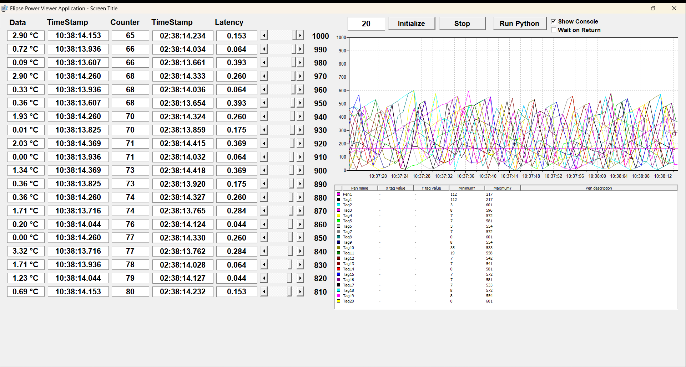
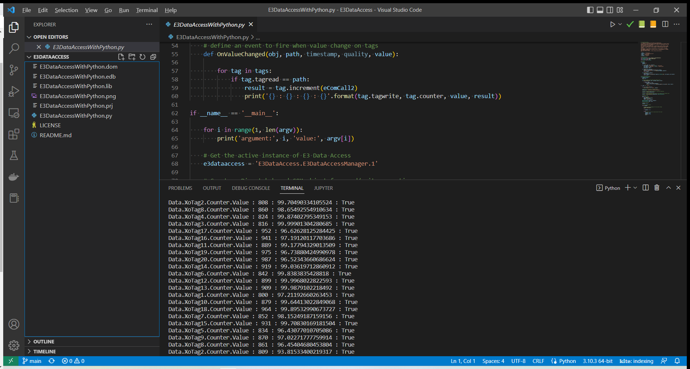

# E3DataAccess
Asynchronous Communication between Elipse E3/Power and Python va E3DataAccess

20 tags are created dynamically to generate data continuously.
The python program subscribes to the Elipse Server via E3DataAccess and receive events on data changes, then increments a counter and write the value on Elipse Server accordingly. Latency is calculated between the time data changes and the counter is incremented.

Elipse E3/Power Interface in Elipse Viewer :

 

Python Terminal running simulatenously in Visual Code :

 

